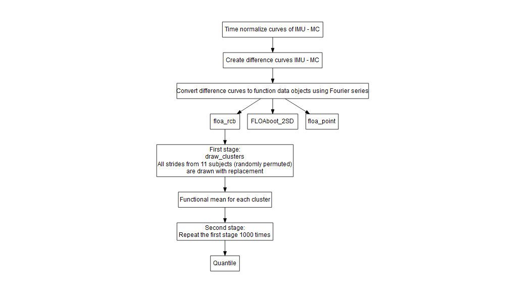

Documentation/overview Functional Limits of Agreement
================
true
10 Juni, 2021

## Zusammenfassung

#### Übergeordnete Fragestellung

“What is the coverage performance of functional prediction bands when
analyzing the agreement between two sets of biomechanical curves?”

Frage ergab sich ursprünglich im Rahmen der Validierung einer
hauseigenen IMU gegenüber einem kamerabasierten Messsystem (Vicon).

Standardvorgehen: Bland & Altman Plots (diskrete Parameter)

Erweiterung für funktionale Daten: Roislien et al. (2012) Functional
Limits of Agreement

#### Functional Limits of Agreement nach Roislien et al.

  - Behandlung von Zeitreihen als funktionale Objekte (Ramsay &
    Silverman)

  - Auswahl einer Zeitreihe je Proband (bei n=7\! im Beispiel) und
    Schätzung der LoA durch Bootstrapping

#### Koska & Maiwald (2020, submitted to Gait & Posture) … Vergleich (coverage) 3er Verfahren:

  - Pointwise (continuous) LoA (FLoAPoint)

  - Functional Limits of Agreement nach Roislien et
    al. (FLoA2SD)

  - Functional limits of agreement using a randomized cluster bootstrap
    (FLoARCB, Koska & Maiwald)

Illustriert wurden die Verfahren am Beispiel eines Datensatzes zur
Validierung einer IMU (MoCap vs. IMU)

#### Methodikbeschreibung FLoARCB (kopiert aus dem Paper)

  - The agreement between the two measurement systems was analyzed based
    on time-normalized difference curves

  - Initially, time-discrete curves 𝑑⃗(𝑡) were converted to functional
    objects 𝑥(𝑡) using a linear combination of 𝐾 (Fourier series)
    functions with weight coefficients 𝑐
    
      - 𝐾 was set relatively high (𝐾=50) to avoid smoothing artifacts
        when fitting the function. The quality of the fit was checked
        visually using plots.

This model includes intra-individual variance from repeated
measurements. To account for the cluster structure generated by similar
curves of the same subject (Fig. 1), we implemented the randomized
cluster bootstrap described in Davison & Hinkley \[20\]. In the first
stage, 𝑛 clusters were drawn with replacement from the original sample.
A single cluster corresponds to all curves of a subject. In the second
stage, observations within the newly generated sample were randomly
permuted (drawing without replacement). The process was repeated 𝐵 times
and mean curves were determined during every iteration.

From the resulting empirical distribution of mean curves 𝑋𝐵∗𝑛∗,
pointwise quantiles (Q2.5, Q97.5) were determined as upper and lower
interval limits: 𝐹𝐿𝑜𝐴𝑅𝐶𝐵= ± 𝑄𝛼/2(𝑋𝑖 𝐵∗𝑛 ∗(𝑡))

## Flowchart FLoARCB

#### Eingereichte Version (problematisch)

<!-- -->

Asymmetrische Limits of Agreement aus einem hierarchischen
(zweistufigen) Bootstrap in Anlehnung an Davison & Hinkley (1997)

#### Vorschlag für verbesserte Variante

## Reviewerkommentare (sortiert nach Wichtigkeit)

#### Vorab etwas Positivität

  - Reviewer \#1: I would like to congratulate the authors for a
    complex, well written and meaningful manuscript. \[…\] I have only
    minor comments: …

  - Reviewer \#2: The general idea behind the manuscript, to evaluate
    agreement between biomechanical curves and to construct prediction
    bands are highly relevant and interesting.

  - Reviewer \#3: The idea that the authors are presenting is quite
    interesting, but theanalyis and evaluation of the various mathods
    contains come serious errors.

#### Major comments

  - Evaluierung anhand weiterer (simulierter) Datensätze

  - In looking at limits of agreement, the authors are considering the
    extent of within pair variation. However, in looking at the point
    wise limits of agreement, these are defined to incorporate a between
    pair standard deviation. Even if it was appropriate to utilise
    between pair variability, the authors should note that it is
    variances that are additive and not SDs. Perhaps the authors lack of
    understanding comes from their *erroneous assumption* (iii).

*iii Measurement uncertainty can be estimated adequately by
bootstrapping the error variance from a sample that consists of a single
curve per subject.*

*If no repeated measurements are included in the sample, an essential
error component (intra-individual variance) is ignored. The bootstrap –
like any other statistical procedure – cannot solve this problem, as it
can only estimate proportions of variance that are contained in the
sample.*

Die erwähnte assumption bezieht sich auf eine Grundannahme die im
Roislien Paper getroffen wurde und in unserem Paper kritisch
aufgegriffen wurde.

  - \[…\] The authors are producing the arithmetic mean curves, the
    variability of which will reflect variation between means. It is the
    variability of individual values that is relevant, and the limits
    will be too narrow by a factor of approximately the square root of
    11.

  - As I understand the description of the paper, the coverage is
    estimated for the curves that are used to estimate the prediction
    bands

  - Detaillierte Beschreibung der Methode erforderlich

  - Mathematische Notation

#### Fragwürdige Einschätzungen seitens der Reviewer

  - Fourier Series sind overfitted: “The effect of overfitting will be
    that the fitted curves wll reflect to a large extent the measurement
    errors associated with each individual point.”

### Mögliche Lösungsansätze

  - Herausnehmen der punktweisen LoA: Die Idee funktionaler Methode
    könnte man als etabliert betrachten. Beim Lesen der
    Reviewerkommentare drängt sich auch der Verdacht auf, dass die
    relativ hohe Komplexität des Papers sich negativ auf das Verständnis
    (der Reviewer) auswirkt.

… siehe dieser Kommentar der Reviewer: Although the pointwise approach
ignores the temporal dependence, it is not an issue when it comes to
estimation. For inference, on the other hand, it should be taken into
account

  - Die FLoA2SD (Roislien et al.) würde ich hingegen erstmal
    drin lassen, da a. unsere Methode darauf aufbaut und b. die Vorteile
    unserer Methode so besser veranschaulicht werden können. Zudem kann
    ich mir vorstellen, dass die Forderung nach einer Vergleichsmethode
    beim Einreichen eines neuen Papers zwangsläufig irgendwann kommt.

  - Datensätze mit ähnlichen Eigenschaften wie typische biomechanische
    Signale simulieren (z. B. Beschleunigungssignale, EMG, EEG)

… evtl. kommen die (vermuteten) Vorteile der FLoARCB bei
Signalen mit höherem Rauschanteil besser zum Tragen.

## Sonstiges

  - FLoARCB als R package

  - Github repository: <https://github.com/koda86/floa>
